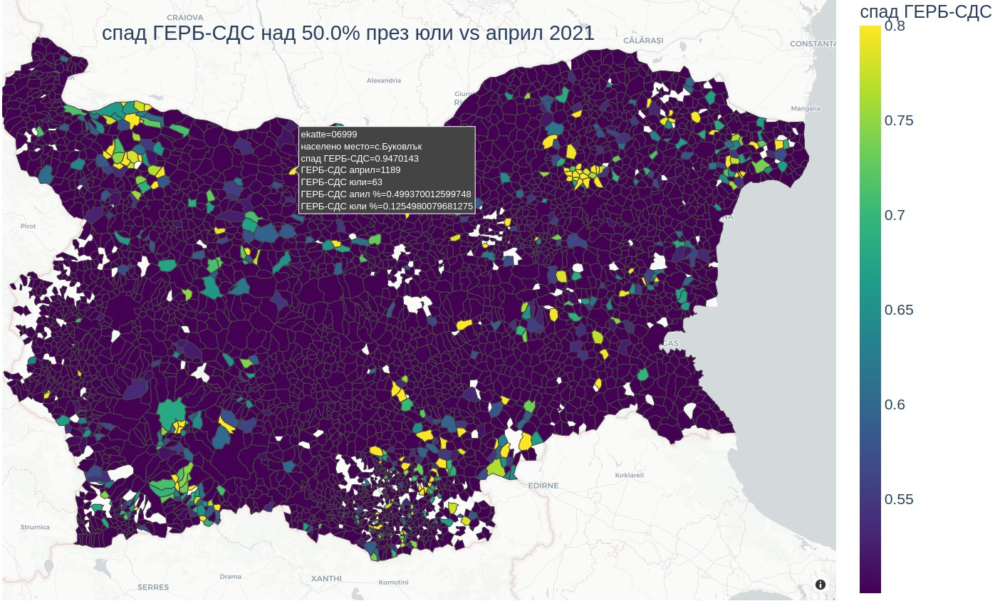
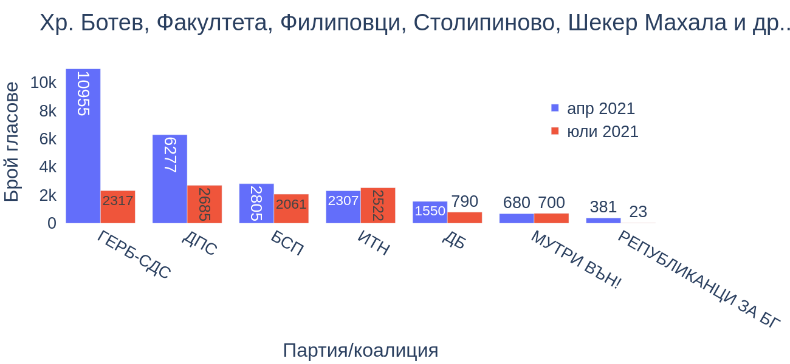

# Контролираният и купен вот в България: оценка на база на изборните резултати от април и юли 2021 г.

Целта на данните представени тук е да позволят на заинтересованите да се запознаят с мащаба и разпределението на купения и контролиран вот в България.

Интересът ми към темата се събуди след изборите през юли 2021 година, когато бях член на секционна комисия в една от ромските махали в София, кв. Христо Ботев. Само три месеца по-рано, на предишните избори през април 2021, в [секция в квартала (244607073)](https://twitter.com/petar_baka/status/1600391396912865280) бяха гласували близо 900 души (95% избирателна активност), а от тея 900 души, 90% бяха гласували за ГЕРБ и ДПС. Местни тартори бяха заплашвали наблюдатели със саморазправа. През юли се бяхме приготвили за същата напрегната обстановка. Противно на очакванията, изборният ден протече спокойно, а общият брой гласували в нашата секция беше около 100 вместо очакваните над 800. Активността и в останалите секции се беше сринала. Почти всички гласове за ГЕРБ и ДПС се бяха изпарили.

В опит да си отговоря на върпоса дали кв. Христо Ботев е единственото място, където е имало подобен срив в подкрепата за ГЕРБ и ДПС, [започнах да ровя в данните](https://twitter.com/petar_baka/status/1535154955836764160). Оказа се, че Христо Ботев съвсем не е изключение. Дали заради въвеждането на машинното гласуване (което затруднява някои от методите за контрол на купения вот), дали защото за първи път от много години вътрешният министър не беше от ГЕРБ (и не разпъваше чадър върху купувачите на гласове), данните разкриваха епидемия от сривове в избирателната активност, която по някаква причина засягаше предимно избирателите на ГЕРБ и ДПС. В секции като тея в Христо Ботев и плевенското село [Буковлък](./../../assets/2021/spadove/6999.html), ГЕРБ и ДПС бяха загубили около 100 хил. гласа (което са около 10 депутатски места при избирателната активност от последните години).

Скоро стана ясно, че има нужда от по-систематизиран подход при анализа и преставянето на данните. Тези страници (както и [изборната търсачка](https://bg-izbori.herokuapp.com/)) са резултат от усилието в тая посока.

Това е проект в развитие.

Всички данни са от [ЦИК](https://results.cik.bg/).

За коментари и намерени грешки: [@petar_baka](https://twitter.com/petar_baka)

## [Населени места с голем спад в общата избирателна активност](./spadove.md)
<!-- сложи картинка -->

## [Населени места с големи спадове в подкрепата за отделни партии](./maps.md)

## [Бедни/ромски махали](./mahali.md)

<!--
## [Населени места с много висока активност](./aktivnost.md)
## [Населени места с много висока подкрепа за ГЕРБ/ДПС](./feodalni.md)
-->

## Допълнително четене

* Карайотова, Мария и Марио Русинов. [Контролираният и купен вот в България. Размер и влияние. (2021)](https://acf.bg/wp-content/uploads/2021/05/Analiz_BG.pdf)
* Русинов, Марио и Никола Тулечки. [Изследване на Антикорупционния фонд (2022)](https://acf.bg/wp-content/uploads/2022/11/izbori_octomvri2022_web-2.pdf)
* Стойчев, Стойчо. [Контролираният и купен вот като инструмент за завладяване на държвата от организирани престъпни мрежи (2017)](https://www.researchgate.net/publication/350410952_Kontroliraniat_i_kupen_vot_kato_instrument_za_zavladavane_na_drzavata_ot_organizirani_prestpni_mrezi_politiceski_riskove_i_tendencii)
