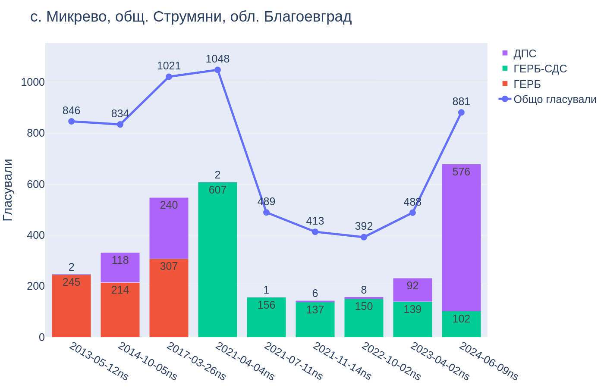

# Процъфтяват ли изборните измами благодарение на Калин Стоянов? 
*[Петър Бакалов](https://twitter.com/petar_baka), 24/08/2024*

Вътрешният министър Калин Стоянов [попитал](https://news.bg/politics/kalin-stoyanov-provaleni-polititsi-si-tarsyat-ala-bala-ministar.html) защо [ППДБ твърдят](https://www.youtube.com/watch?v=B3979VLmqSY), че благодарение на него изборните измами процъфтяват и купените гласове са нарастнали с 35 хил. гласа.

Не знам как точно ППДБ са стигнали до това число, но подозирам, че са гледали секциите с резки скокове в резултатите на ГЕРБ/ДПС.

### Какво наричаме резки скокове?

Една от секциите, където ГЕРБ рязко набират популярност е в Столипиново, една от ромските махали на Пловдив. В секция 162202024 там ГЕРБ подобряват резултата си 20 пъти (от 7 гласа на 139). Десетки други секции в квартала показват подобни резки скокове (виж резултатите в ромските махали на София и Пловдив в [нишката тук](https://twitter.com/petar_baka/status/1804733723016864117)).

Сходни скокове виждаме и при ДПС. Примерно в жк Филиповци, една от ромските махали на София. В трите секции там ДПС са 110 пъти нагоре, от 3 гласа през април 2023 на 339 през юни 2024 (секции 254619071, 254619072, 254619132).

### Колко общо са тези секции?

Отговорът на този въпрос зависи от това какво смятаме за "рязък скок". Ако погледнем секциите където ГЕРБ/ДПС качват резултатите си поне двойно спрямо април 2023, намираме ръст от [20 хил. гласа за ДПС](../assets/2024/top_dps2024.html) в около 300 секции и [10 хил. гласа за ГЕРБ](../assets/2024/top_gerb2024.html) в около 100 секции. Средно и двете партии подобряват резултатите си в тея секции тройно.

### Защо пък да са съмнителни секции, където ГЕРБ/ДПС качват двойно или повече?

Защото на последните избори ГЕРБ губят 140 хил. гласа на национално ниво, спад от 20%. Тоест, на повечето места ГЕРБ са надолу. Всяка секция, в която ГЕРБ рязко вдигат резултатите си, буди интерес.

Същата логика важи и при ДПС, които на национално ниво са около 10% нагоре. Секции със значително по-голям скок са интересни.

### Знаем ли със сигурност, че става дума за купуване на гласове?

Не е ли възможно просто гласуващите в бедните махали Филиповци и Столипиново (и стотици други бедни населени места из държавата) рязко и масово да са открили любовта си към ГЕРБ/ДПС? Възможно е, но и тая относително невероятна хипотеза на свой ред повдига въпроси.

### А защо смятаме, че вътрешният министър може да има роля в тея резки скокове?

Основание за това ни дава поглед по-назад в миналото. При изборите през юли 2021 за първи път от години вътрешният министър не беше от ГЕРБ. Тогава служебен вътрешен министър беше Рашков. И тогава имаше "скокове", но в отрицателен смисъл -- резултатите на ГЕРБ/ДПС в бедните махали в София, Пловдив и на много други места се сринаха спрямо изборите през април 2021, само три месеца по-рано, когато вътрешен министър беше Терзийски (ГЕРБ) (за някои от по-интересните резултати от април/юли 2021 сме писали [по-рано](./2021/top)).

От юли 2021 досега четири пъти избирахме НС при вътрешен министър не от ГЕРБ (два пъти Рашков и два пъти Демерджиев). Така стигаме до юни 2024, когато вижаме как с г-н Калин Стоянов начело на МВР в някои от същите тея махали гласуващите отново масово заобичват ГЕРБ/ДПС.

Може да е случайност. Но почти същата графика се повтаря отново и отново. Това, което виждаме във Филиповци и Столипиново, виждаме в стотици секции: срив в активността през юли 2021, ниска активност до юни 2024, когато активността скача отново.  Резултатите в с. Микрево, Благоевградско, (на графиката) са типичен пример (още примери [тук](https://twitter.com/petar_baka/status/1806201125101511119)).

Микрево илюстрира и друго явление, което се наблюдава на някои места. Изчезналите през юли 2021 близо 500 гласа за ГЕРБ се завръщат през юни 2024, но вече като гласове за ДПС. Тези изчезващи и преливащи гласове идват от две секции в селото. В другите две не се наблюдават такива колебания нито в активността, нито в нагласите на гласуващите. В Микрево, пътем, е една от най-големите ромски махали в Благоевградско. 

### Това ли е целият купен вот? 
Не, това е само приблизителна оценка на ръста в купения вот през юни 2024. Тук си струва да отбележим, че нашият прост критерии "резки скокове" хваща предимно секции, където ръстът на купения вот (ако приемем, че е такъв) е много очевиден. Доста вероятно има секции, където процентът купен/контролиран вот е по-малък, и съответно не може да се засече с такъв прост метод, като представения тук. Тоест оценката за ръст от около 30 хил. гласа е само най-видимата част от купения/контролирания вот.

За коментари: [@petar_baka](https::/twitter.com/petar_baka)

